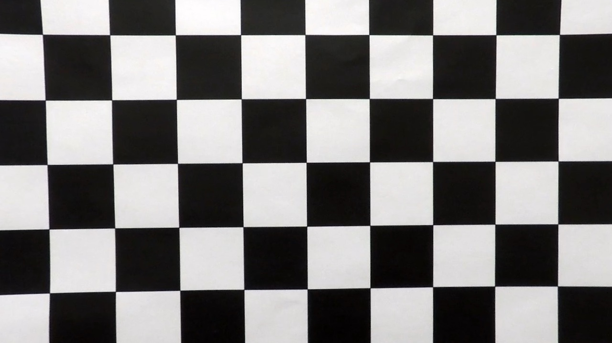

**Advanced Lane Finding Project**

The goals / steps of this project are the following:

* Compute the camera calibration matrix and distortion coefficients given a set of chessboard images.
* Apply a distortion correction to raw images.
* Use color transforms, gradients, etc., to create a thresholded binary image.
* Apply a perspective transform to rectify binary image ("birds-eye view").
* Detect lane pixels and fit to find the lane boundary.
* Determine the curvature of the lane and vehicle position with respect to center.
* Warp the detected lane boundaries back onto the original image.
* Output visual display of the lane boundaries and numerical estimation of lane curvature and vehicle position.

[//]: # (Image References)

[image10]: ./camera_cal/calibration1.jpg "Original"
[image20]: ./output_images/undistorted/calibration1.jpg "Undistorted"
[image2]: ./output_images/undistorted/test1.jpg "Road Transformed"
[image3]: ./output_images/combined_binary/test1.jpg "Binary Example"
[image4]: ./examples/warped_straight_lines.jpg "Warp Example"
[image5]: ./output_images/polynomial/poly.PNG "Fit Visual"
[image6]: ./output_images/video.PNG "Output"
[video1]: ./project_video.mp4 "Video"


### Camera Calibration


The code for this step is contained in the first code cell of the IPython notebook located in "./P2.ipynb".

I start by preparing "object points", which will be the (x, y, z) coordinates of the chessboard corners in the world. Here I am assuming the chessboard is fixed on the (x, y) plane at z=0, such that the object points are the same for each calibration image.  Thus, `objp` is just a replicated array of coordinates, and `objpoints` will be appended with a copy of it every time I successfully detect all chessboard corners in a test image.  `imgpoints` will be appended with the (x, y) pixel position of each of the corners in the image plane with each successful chessboard detection.  

I then used the output `objpoints` and `imgpoints` to compute the camera calibration and distortion coefficients using the `cv2.calibrateCamera()` function.  I applied this distortion correction to the test image using the `cv2.undistort()` function and obtained this result: 
<p>
  

### Pipeline (single images)

#### 1. Distortion Correction

I apply distortion to images via `cv2.undistort()` function in the second code cell of the IPython notebook located in "./P2.ipynb". Here is the result.

![alt text][image2]

#### 2. Apply color transforms and gradients to create a thresholded binary image.

I used a combination of color and gradient thresholds to generate a binary image (thresholding steps in the third code cell of the IPython notebook located in `./P2.ipynb`).  Here's an example of my output for this step.

![alt text][image3]

#### 3. Performed a perspective transform.

The code for my perspective transform includes a function called `warper()`, which appears in in the 5th code cell of the IPython notebook.  The `warper()` function takes as inputs an image (`img`), as well as source (`src`) and destination (`dst`) points.  I chose the hardcode the source and destination points in the following manner:

```python
src = np.float32(
    [[(img_size[0] / 2) - 58, img_size[1] / 2 + 100],
    [((img_size[0] / 6) - 10), img_size[1]],
    [(img_size[0] * 5 / 6) + 60, img_size[1]],
    [(img_size[0] / 2 + 65), img_size[1] / 2 + 100]])
dst = np.float32(
    [[(img_size[0] / 6), 0],
    [(img_size[0] / 6), img_size[1]],
    [(img_size[0] * 3 / 3.5), img_size[1]],
    [(img_size[0] * 3 / 3.5), 0]])
```

This resulted in the following source and destination points:

| Source        | Destination   | 
|:-------------:|:-------------:| 
| 582, 460      | 213, 0        | 
| 203, 720      | 213, 720      |
| 1127, 720     | 1097, 720     |
| 705, 460      | 1097, 0       |

I verified that my perspective transform was working as expected by drawing the `src` and `dst` points onto a test image and its warped counterpart to verify that the lines appear parallel in the warped image.

<p>
  

#### 4. Identified lane-line pixels and fit their positions with a polynomial

Then I implement sliding windows and fit my lane lines with a 2nd order polynomial  like this which appears in in the 8th code cell of the IPython notebook:

![alt text][image5]

#### 5. Calculated the radius of curvature of the lane and the position of the vehicle with respect to center.

I did this in in the 11th code cell of the IPython notebook

#### 6. Example image of my result plotted back down onto the road such that the lane area is identified clearly.

I implemented this step in the 14th code cell of the IPython notebook in the function `process_image()`.  Here is an example of my result on a test image:

![alt text][image6]

---

### Pipeline (video)


Here's a [link to my video result](./project_video_output.mp4)

---

### Discussion

My pipeline could be more robust on the extreme color change scenarios such as passing a bridge or pass under tree situations. My pipeline will not perform well if the curvature of the road increase dramatically. 

My pipeline could be improved with adding a couple of functionality, such as take average the previous lines or give weight to them. Masking and search from prior poly function could be adjusted to work better on curvy road scenarios.
